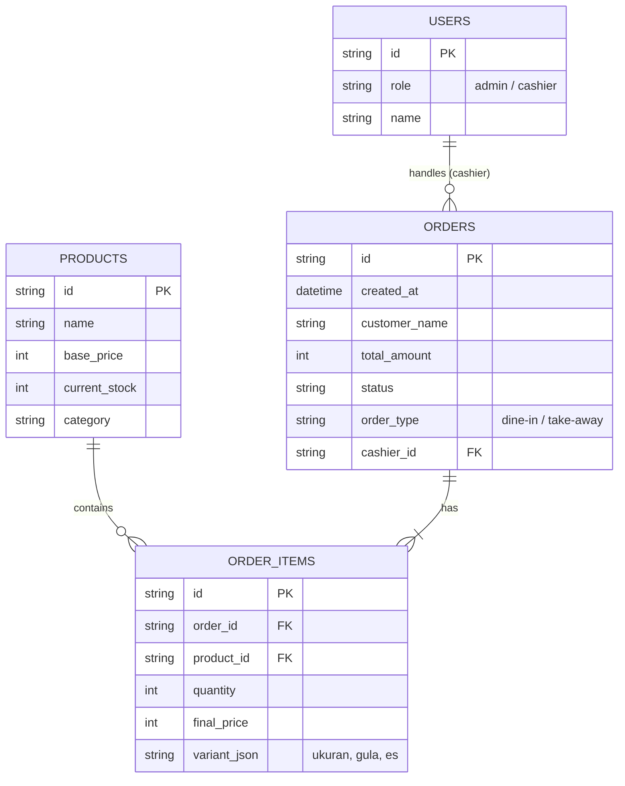

# Panduan Arsitektur Database & State Management - Teh Raja POS

Dokumen ini disusun sebagai panduan jawaban atau referensi teknis jika Anda ditanya mengenai keputusan penggunaan arsitektur data (Database & State Management) pada platform Teh Raja POS, baik dalam sidang PKL, presentasi ke klien, maupun wawancara teknis.

---

## 1. Apa Database yang Digunakan?
Teh Raja POS menggunakan **Firebase Realtime Database (NoSQL)** sebagai database utama (Backend-as-a-Service) yang dikombinasikan dengan **Zustand** sebagai sistem manajemen memori lokal (*Global State Management*) di sisi klien.

### Mengapa Memilih Firebase Realtime Database?
Jika ditanya, **"Mengapa tidak pakai MySQL/PostgreSQL saja?"**, berikut adalah jawaban utamanya:
1. **Kebutuhan Real-Time yang Sangat Kritis:** POS dan pemesanan restoran membutuhkan sinkronisasi data seketika (sub-detik). Saat pelanggan memesan via HP (`/menu`), pesanan tersebut harus **langsung muncul atau berbunyi** di layar kasir (`/pos`) tanpa perlu me-refresh halaman. Firebase RTDB menggunakan protokol *WebSocket* (pub/sub) yang secara *native* memang didesain untuk *live-sync* ini.
2. **Skema Data Berbasis Dokumen (JSON Tree):** Data transaksi POS sering kali tidak statis. Misalnya, setiap *item* memiliki struktur varian yang berbeda (gula, ukuran, es, topping). Menyimpan struktur JSON dinamis jauh lebih cepat dan fleksibel di database NoSQL pada fase awal pengembangan dibandingkan harus menormalisasi banyak tabel di SQL.
3. **Optimasi untuk Edge & Serverless:** Dengan Next.js, Firebase memungkinkan kita berjalan tanpa harus menyewa dan melakukan *maintenance* server *backend* tersendiri (seperti Node.js/Express) secara manual.

---

## 2. Bagaimana Sistem Menangani Internet yang Putus? (Robust Offline-First)
Jika ditanya, **"Bagaimana kalau di kedai tiba-tiba Wi-Fi mati atau internet putus? Apakah transaksi hilang?"**

**Jawaban:**
Tidak. Aplikasi ini dirancang dengan arsitektur **Offline-First**. 
1. **Zustand sebagai Buffer:** Semua transaksi kasir diproses terlebih dahulu di memori browser (Zustand) dan disimpan ke dalam *Local Storage*.
2. **Offline Queue:** Jika Firebase mendeteksi koneksi terputus, sistem secara otomatis memasukkan transaksi baru ke dalam *Array Offline Orders*. Kasir tetap bisa melayani pelanggan, mencetak struk thermal, dan melihat data penjualan tanpa *lag* sedikitpun.
3. **Background Sync:** Begitu sistem mendeteksi koneksi internet kembali menyala (melalui komponen `FirebaseSync.tsx`), sistem akan melakukan injeksi balik (*flush*) seluruh antrean data secara otomatis ke *cloud* tanpa bentrokan (*race condition*).

---

## 3. Mengapa Menggunakan Zustand (Bukan Redux atau Context API)?
Jika ditanya tentang *State Management* (pengelolaan memori klien):

**Jawaban:**
1. **Performa Render Kasir:** React Context API memiliki kelemahan mendasar: setiap kali nilai *context* berubah, *seluruh* komponen di dalamnya akan me-render ulang. Dalam POS kasir dengan ratusan tombol menu, hal ini akan menyebabkan UI nge-*lag*. **Zustand menyelesaikan ini** karena hanya me-render ulang komponen spesifik yang memanggil *state* terkait (*selective rendering*).
2. **Minimalis & Cepat:** Redux membutuhkan terlalu banyak kode kotor (*boilerplate*, *reducers*, *actions*). Zustand memungkinkan penyimpanan data global (Keranjang, Stok, Log Penjualan) secara ringkas, sehingga ukuran *bundle size* aplikasi tetap ringan (sangat krusial untuk PWA di HP spesifikasi rendah).

---

## 4. Rencana Peningkatan untuk Skala Enterprise (Market Nasional)
Jika ditanya, **"Apakah database ini kuat jika kedai Teh Raja buka 100 cabang di seluruh Indonesia?"**

**Jawaban (Diplomatis & Berwawasan Arsitektur):**
"Untuk tahap saat ini (skala UMKM / 1-5 cabang), arsitektur Firebase + Zustand adalah yang **paling optimal dan hemat biaya operasional**. 

Namun, jika platform ini akan dipasarkan secara massal (SaaS B2B) ke ratusan *franchise*, saya sudah merancang rencana *scaling*. Kami akan mengadopsi pendekatan **Polyglot Persistence**:
1. **PostgreSQL (via Supabase):** Akan digunakan sebagai *Database Master* (sumber kebenaran utama) untuk memproses analitik berat lintas-cabang (misal: membandingkan omzet cabang Jakarta vs Surabaya). SQL jauh lebih baik untuk agregasi laporan dan relasi multi-cabang (Role-Based Access).
2. **Redis / Firebase (Tetap dipertahankan):** Hanya akan difokuskan sebagai *Message Broker* atau *Live Queue* untuk komunikasi soket secara *real-time* di dalam kedai itu sendiri (antara pelanggan dan kasir).

---

## 5. Skema & Relasi Database (Data Modeling)

Meskipun saat ini Teh Raja POS menggunakan NoSQL (Firebase), data tetap diatur dengan prinsip *relasi konseptual* agar tidak redundan dan mudah diindeks. Berikut adalah penjelasan struktur datanya, beserta bagaimana relasi ini akan dibentuk jika nantinya bermigrasi ke database Relasional (SQL):

### A. Struktur NoSQL Saat Ini (Firebase Realtime Database)
Karena NoSQL tidak memiliki *Foreign Key* (Kunci Asing) secara harfiah, relasi dibuat menggunakan teknik **Denormalisasi Terkendali** (*Controlled Denormalization*) dan penumpukan struktur JSON (*Nesting*).

*   **Node `/products` (Master Data Produk):** Berisi ID produk, nama, harga dasar, kategori, dan stok saat ini.
*   **Node `/orders` (Data Transaksi):** 
    *   Satu order (transaksi) menyimpan data pelanggan, total harga, status (*pending/completed*), tipe pemesanan (*dine-in/takeaway*).
    *   Satu order memiliki relasi **1-to-Many** dengan `/items`.
    *   Daripada hanya menyimpan ID Produk, sistem menyimpan salinan data produk beserta *opsi varian unik* (seperti `sugar: "less"`, `ice: "normal"`, `size: "L"`). Ini penting dalam aplikasi POS agar riwayat transaksi masa lalu tidak berubah jika harga/nama produk di-*update* di masa depan.
*   **Node `/logs` (Log Aktivitas):** Menyimpan histori aksi pengguna dan kasir (kapan kasir login, kapan stok diperbarui).

### B. Proyeksi Skema Relasional (Entity Relationship) untuk Migrasi SQL
Jika dosen atau klien menanyakan bentuk Entity Relationship Diagram (ERD) standar SQL-nya, skema relasinya akan berbentuk seperti ini:

**Penjelasan Relasi SQL (Untuk Laporan PKL/Skripsi):**
1. **ORDERS ke ORDER_ITEMS (1 to Many):** Satu struk transaksi (Order) bisa memuat banyak jenis minuman (Order Items). Relasi ini dihubungkan lewat `order_id` sebagai *Foreign Key*.
2. **PRODUCTS ke ORDER_ITEMS (1 to Many):** Satu produk di menu bisa dibeli berkali-kali di struk yang berbeda. Dihubungkan lewat `product_id`.
3.  Pemisahan `ORDER_ITEMS` mutlak diperlukan dalam SQL agar kita bisa menyimpan kustomisasi pembeli (seperti upcharge harga untuk *Size L* atau pilihan gula) yang spesifik *hanya* untuk minuman pada transaksi tersebut, tanpa mengubah harga master di tabel `PRODUCTS`.
