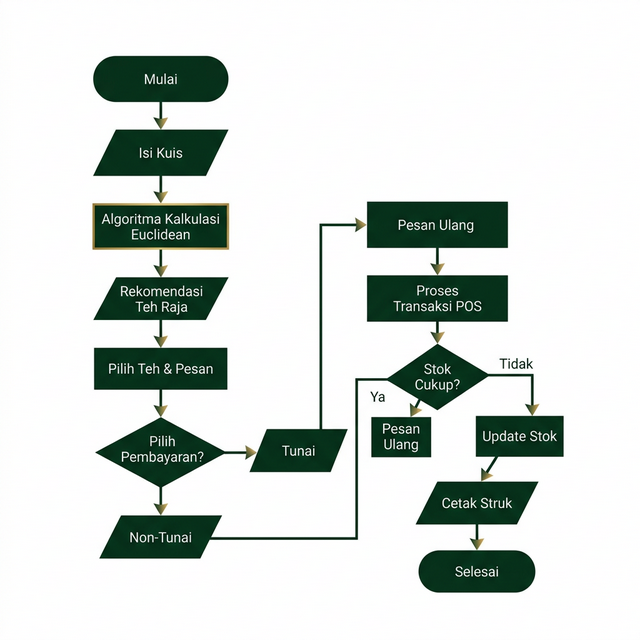
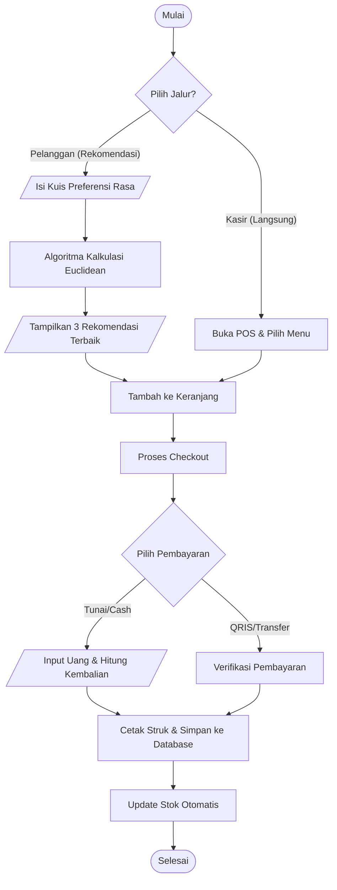
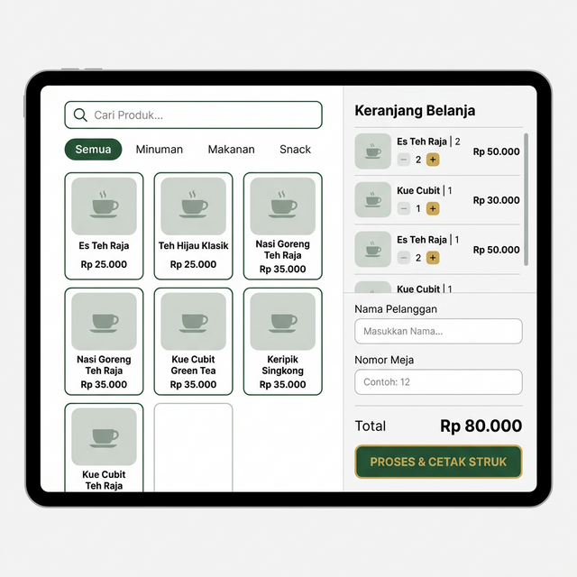
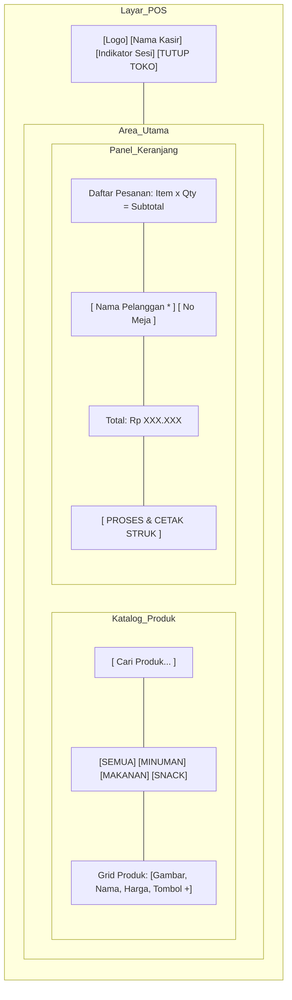
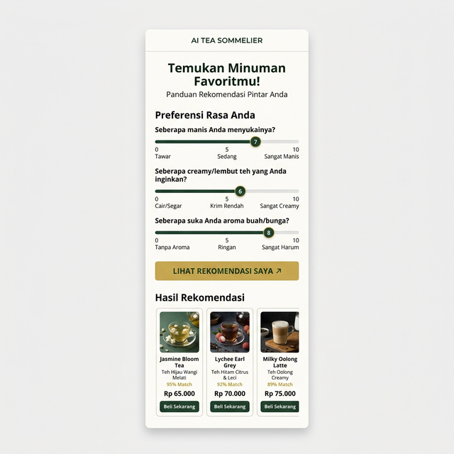
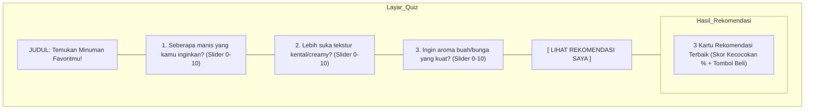

# Proposal Pengembangan Sistem POS & Smart Recommendation "Teh Raja"

## 1. Latar Belakang
Dalam industri minuman kekinian yang semakin kompetitif, pelanggan seringkali menghadapi *choice overload* atau kebingungan dalam memilih menu karena banyaknya variasi rasa (Manis, Creamy, Fruity) dan nama menu yang unik. Di sisi operasional, staf seringkali harus mengulang penjelasan karakteristik rasa kepada setiap pelanggan, yang berpotensi memperpanjang antrean dan menurunkan efisiensi layanan.

**Teh Raja** hadir dengan solusi digital terintegrasi yang menggabungkan sistem *Point of Sale* (POS) modern dengan fitur **Smart Recommendation (AI Tea Sommelier)**. Sistem ini menggunakan algoritma cerdas untuk membantu pelanggan menemukan minuman yang paling sesuai dengan selera mereka secara instan, sekaligus memberikan alat manajemen yang kuat bagi pemilik toko.

## 2. Tujuan
1.  **Personalisasi Pengalaman Pelanggan**: Menyediakan fitur rekomendasi berbasis preferensi rasa (Euclidean Distance Algorithm) untuk membantu pelanggan memilih menu dengan percaya diri.
2.  **Digitalisasi Operasional**: Menggantikan pencatatan manual dengan sistem POS digital yang mendukung manajemen stok, sesi kasir (Buka/Tutup Toko), dan pencetakan struk.
3.  **Efisiensi Layanan**: Mempercepat proses pemesanan melalui antarmuka yang intuitif dan integrasi otomatis ke WhatsApp serta Firebase Realtime Database.
4.  **Akurasi Data**: Memastikan setiap transaksi dan pergerakan stok tercatat secara akurat untuk keperluan laporan harian dan analisis performa.

## 3. Manfaat
*   **Bagi Pelanggan**: Mendapatkan rekomendasi yang akurat sesuai selera, proses pemesanan yang cepat, dan kemudahan dalam melihat detail pesanan (struk digital).
*   **Bagi Kasir/Staff**: Mengurangi beban kerja dalam menjelaskan menu secara manual, meminimalkan kesalahan input pesanan, dan memudahkan proses rekap/laporan harian.
*   **Bagi Pemilik (Owner)**: Memiliki kontrol penuh terhadap inventaris, memantau kinerja toko secara real-time dari mana saja, dan mendapatkan data pelanggan untuk strategi pemasaran.

## 4. Flowchart Sistem

## 5. Wireframe Aplikasi
Representasi tata letak antarmuka utama (High-Level Wireframe):

### A. Interface POS (Point of Sale)
Menampilkan tata letak layar kasir yang terbagi menjadi dua panel utama.

### B. Interface AI Recommendation (Quiz)
Antarmuka interaktif bagi pelanggan untuk mendapatkan saran menu.

## 6. Penutup
Sistem **Teh Raja** dirancang bukan hanya sebagai aplikasi kasir biasa, melainkan sebagai ekosistem digital yang meningkatkan *value* brand melalui kecerdasan buatan sederhana namun efektif. Dengan hardening yang telah dilakukan, sistem ini siap untuk diimplementasikan dalam skala produksi.
